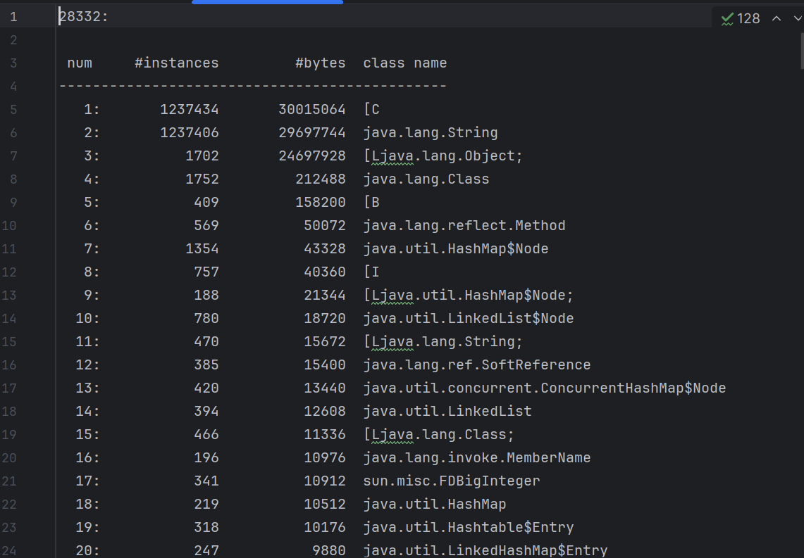
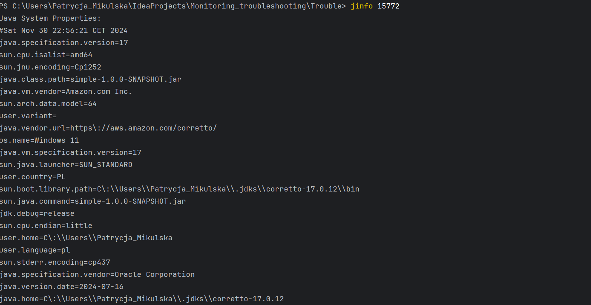

## Quiz
#### Prepare answers to following questions:
* Which interface JDK tools use to connect to JVM locally?
##### Java Management Extensions (JMX) technology provides a standard API for the management and monitoring of resources. The API includes remote access, so that a remote management application can manage and monitor applications, systems, and networks.
* What is difference between profiling and traceability?
##### Profiling is the process of measuring an application or system by running an analysis tool called a profiler. Profiling tools can focus on many aspects: functions call times and count, memory usage, cpu load, and resource usage.
##### Tracing is a specialized use of logging to record information about a program's execution.

## OutOfMemory (OOM) error troubleshooting
#### Get OOM error

#### Use jvisualvm to observe OOM


#### Get heap dump
##### Using -XX:+HeapDumpOnOutOfMemoryError option - file java_pid16876.hprof


##### [Optional] Using jcmd
h1.hprof


##### [Optional] Using jmap
Start of app: - snapshot2.hprof

Just before OOE: - snapshot3.hprof


#### Get heap histogram
##### Using jcmd - jcmd_hist.txt

##### Using jmap - jmap_hist.txt


#### Analyze heap dump
##### Using Java Visual VM
- Open retrieved heap dump in jvisualvm


- 
- Identify memory leak

##### OQL
Execute OQL in jvisualvm:

    select objs from java.lang.Object[] objs where objs.length > 100


    select referrers(objs) from java.lang.Object[] objs where objs.length > 100


    select referrers(arr) from java.util.ArrayList arr where arr.size > 100


Startup `jhat` (note: `jhat` was decommissioned in JDK 9)
```
    jhat <head_dump.hprof>
```

Execute OQL in jhat

    select [objs, objs.length] from [Ljava.lang.Object; objs where objs.length > 100


    select referrers(objs) from [Ljava.lang.Object; objs where objs.length > 100


    select referrers(arr) from java.util.ArrayList arr where arr.size > 100


Please note small OQL syntax difference in jhat and jvisualvm.

## Deadlock troubleshooting
#### Get deadlock
- Execute java application that simulates deadlock:

```
    java -jar deadlock-1.0.0-SNAPSHOT.jar
```


- Get thread dump and locate lines similar to:
jvisulamvm or jcmd pid Thread.print
```
Found one Java-level deadlock:
=============================
"Thread 2":
  waiting to lock monitor 0x000000001bf40b68 (object 0x000000076b7777c8, a java.lang.Object),
  which is held by "Thread 1"
"Thread 1":
  waiting to lock monitor 0x000000001bf43608 (object 0x000000076b7777d8, a java.lang.Object),
  which is held by "Thread 2"

Java stack information for the threads listed above:
===================================================
"Thread 2":
        at com.epam.jmp.mat.deadlock.SimulateDeadLock.method2(SimulateDeadLock.java:44)
        - waiting to lock <0x000000076b7777c8> (a java.lang.Object)
        - locked <0x000000076b7777d8> (a java.lang.Object)
        at com.epam.jmp.mat.deadlock.DeadLockMain$2.run(DeadLockMain.java:18)
"Thread 1":
        at com.epam.jmp.mat.deadlock.SimulateDeadLock.method1(SimulateDeadLock.java:24)
        - waiting to lock <0x000000076b7777d8> (a java.lang.Object)
        - locked <0x000000076b7777c8> (a java.lang.Object)
        at com.epam.jmp.mat.deadlock.DeadLockMain$1.run(DeadLockMain.java:11)

Found 1 deadlock.
```

#### Get thread dump
1} jstack


2} kill -3
not working on Windows

3} jvisualvm


4} Windows (Ctrl + Break)
no break key for dell

5} jcmd


## Remote JVM profiling
Using [JMX Technology](https://docs.oracle.com/javase/8/docs/technotes/guides/management/agent.html)
```
    java -jar -Dcom.sun.management.jmxremote -Dcom.sun.management.jmxremote.port=7890 -Dcom.sun.management.jmxremote.authenticate=false -Dcom.sun.management.jmxremote.ssl=false simple-1.0.0-SNAPSHOT.jar
```
Connect to JVM using jconsole:


## Inspect a Flight Recording
Execute JVM with two special parameters:
```
    java -jar -Xmx100m -XX:+UnlockCommercialFeatures -XX:+FlightRecorder -XX:StartFlightRecording=dumponexit=true,filename=flight.jfr heap-1.0.0-SNAPSHOT.jar
```


Enable Flight Recording on JVM without these parameters:
```
    java -jar -Xmx100m -XX:+UnlockCommercialFeatures heap-1.0.0-SNAPSHOT.jar
    jps -lvm
    jcmd <pid> JFR.start name=heap_recording filename=flight.jfr dumponexit=true
```


Open Java Mission Control and connect to default HotSpot of our JVM:
```
    jmc
```


## jinfo
Print system properties and command-line flags that were used to start the JVM.
```
    java -jar simple-1.0.0-SNAPSHOT.jar
    jps
    jinfo <pid>
```



## Practical task evaluation rules:
* OOM errors troubleshooting : 30 points
* Deadlock troubleshooting : 30 points
* Remote JVM profiling : 20 points
* FlightRecorder : 20 points

